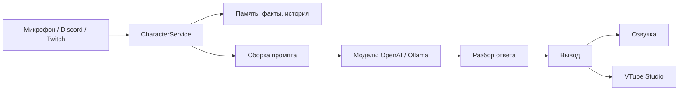

# BoyKisserAI

AI-VTuber бот для стримов: общается голосом и текстом через микрофон, Discord и Twitch, озвучивает ответы, управляет 2D-аватаром в VTube Studio и запоминает собеседников.

## Возможности

- Разговаривает через микрофон, Discord и Twitch — распознаёт речь, отличает свой голос от чужого во время озвучки, чтобы не отвечать сам себе.
- Может работать на разных "движках" в зависимости от настроек: генерация ответов, распознавание и озвучка речи — через OpenAI, Yandex SpeechKit или локальную модель. Переключается в конфиге, без правок кода.
- У персонажа есть настроение, "фаза характера" и отношение к каждому конкретному человеку — всё это влияет на то, как он отвечает.
- Помнит собеседников: факты о них и заметки о прошлых косяках хранятся в базе данных.
- Помнит недавний разговор какое-то время, а если человек долго не пишет — забывает сам, без ручного сброса перед каждым стримом.
- Может временно игнорировать людей, которые ведут себя токсично, и снимает игнор, если человек извинился.
- Двигает ртом и переключает выражения лица в VTube Studio в такт озвучке.
- Есть desktop-панель: видно текущее состояние бота, историю переписки по каналам, можно вручную задать настроение или замьютить канал.

## Архитектура

Код разложен по слоям:

```
config/      настройка приложения и внешних клиентов
domain/      константы, сущности базы данных, модели данных для внешних API
provider/    всё, что общается с внешним миром — Discord, Twitch, OpenAI, Yandex, VTube Studio, микрофон
repository/  доступ к базе данных
service/     логика: диалог, память, промпты, состояние персонажа
ui/          desktop-панель управления
```

Генерация ответов, распознавание и озвучка речи вынесены в отдельные взаимозаменяемые блоки — какой именно сервис используется, решает конфиг, а не код.



Модель отвечает в структурированном виде — текст реплики отдельно от эмоции, изменения доверия и действия. Если модель вдруг ответит не в ожидаемом формате, бот не падает, а отвечает нейтрально.

## Технологии

Java 17, Spring Boot, PostgreSQL, Redis, JDA (Discord), twitch4j, Lombok, Jackson, JUnit + Mockito, Java Swing.

## Запуск

### Что понадобится

- JDK 17
- Docker — под ним поднимаются база данных и Redis
- Ключи API тех сервисов, которые собираетесь использовать (OpenAI и/или Yandex), токен Discord-бота и/или Twitch, если нужны эти интеграции

### Настройка

1. Поднять базу данных и Redis:
   ```
   docker-compose up -d
   ```
2. Скопировать `src/main/resources/application-example.yml` в `application.yml` и вписать свои токены и ключи.
3. Запустить:
   ```
   ./mvnw spring-boot:run
   ```

Приложение откроет desktop-панель и подключится к тем сервисам, которые заполнены в конфиге.

### Тесты

```
./mvnw test
```

## Что можно улучшить

Это осознанные упрощения, а не забытые баги:

- Пока бот отвечает одному человеку, остальные ждут своей очереди — сообщения обрабатываются по одному, не параллельно. Для одного стрима это не проблема, но при большой нагрузке стало бы узким местом.
- Интерфейс дашборда обновляется по таймеру, а не сразу при изменении данных. Для одного локального пользователя это не заметно на глаз, но не самый эффективный способ.